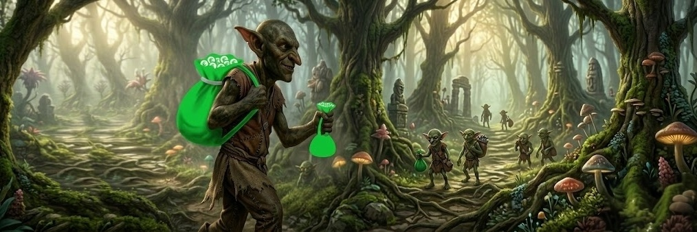

# 👺 $GBAGS | Goblin Bags on Solana

> **"In the world of Solana, every Goblin deserves their Green Bag."**

$GBAGS is a community-centric meme token built on the Solana blockchain. Inspired by the SocialFi movement and the "hoarding" culture of the most dedicated traders, we aim to build the strongest 'green bag' community in the ecosystem.

---

## 🟢 Core Values
* **Transparency:** Open-source blueprints and community-led growth.
* **Greed for Green:** A tribute to the legendary green bags of Bags.fm.
* **Degen Spirit:** Built by Goblins, for Goblins.

---

## 📊 Tokenomics
| Property | Value |
| :--- | :--- |
| **Token Name** | Goblin Bags |
| **Ticker** | $GBAGS |
| **Total Supply** | 1,000,000,000 |
| **Blockchain** | Solana (SPL) |
| **Mint & Freeze** | Revoked (Renounced) 🛡️ |
| **Liquidity** | 100% Burned 🔥 |

---

## 🗺️ Strategic Roadmap

### **Phase 1: The Gathering** 🕯️
- [ ] Fair Launch via **bags.fm**.
- [ ] Community portal (Telegram & X) activation.
- [ ] Initial "Goblin Raid" marketing campaign.

### **Phase 2: The Hoard Grows** 💰
- [ ] Successful migration to **Raydium**.
- [ ] Liquidity Pool (LP) burning.
- [ ] Listing on **Dexscreener** and **Birdeye**.
- [ ] Community-led "Green Bag" photo contests.

### **Phase 3: Goblin Hegemony** 👑
- [ ] Strategic partnerships with Solana SocialFi influencers.
- [ ] CEX Listing applications.
- [ ] Integration with community-driven tracking tools.

---

## 🚀 How to Acquire $GBAGS
1.  **Create a Wallet:** Use [Phantom](https://phantom.app/) or Solflare.
2.  **Deposit SOL:** Transfer $SOL to your wallet for gas and swapping.
3.  **Swap:** Use bags.fm (early phase) or Raydium/Jupiter (post-launch) to swap $SOL for **$GBAGS**.

## 📜 Contract Address (CA)
`CMR66qiZCTzdohVoArpfPXE1AyMbeuuAuySRSxAUBAGS`

---

## 🔗 Official Links
* **X (Twitter):** [https://x.com/_gbags]
* **Telegram:** [soon]
* **Website:** [soon]

---
**Disclaimer:** $GBAGS is a meme coin created for entertainment purposes only. It has no intrinsic value or expectation of financial return. Please trade responsibly.
